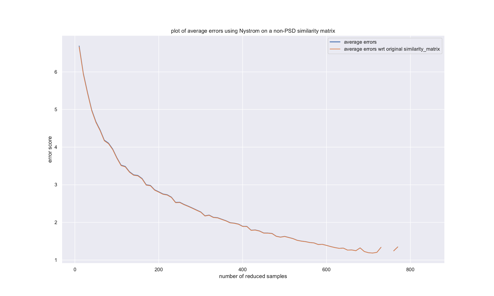

## Installing:
1. tensorflow 2.0
2. pytorch
3. seaborn

## To run this in your machine:
1. run `make_test.sh` to create the test set.
2. copy `new_test.tsv` to `Dataset/STS-B/test.tsv`
3. delete files in `Dataset/models`
4. execute `run.sh` to generate the predictions file.
5. run `analyze_outputs.sh` to see the distribution of the eigenvalues

## Results:
We basically have two moderately promising avenues. 

1. There are two versions of the results of this section
a. where the minEig is taken from the submatrix and 
b. the minEig is taken from the submatrix of size sqrt(i x n).

The method applied is `A - minEig x I`. The following are the plots: 
1a. 
1b. 
1c. 

1c and 1 a are interesting. While both uses the same method, the eps used as an offset is changed from 1e-1 to 1e-5 for c. Reason needs to be determined.

Incompleteness of 1b is due to some numerical instability at higher sample rates. We need to figure this out.

All methods use the Laplacian normalization: `D^(1/2) x D_bar^(-1/2) x K_bar x D_bar^(-1/2) x D^(1/2)`, where D is the diagonal of the original matrix and D_bar is the diagonal of the approximated matrix.

2. We find the min positive eigenvalue and set `A - minposEig x I`. The following are the plots:
2a. 
2b. 

Here 2b uses row normalization and 2a uses Laplacian normalization.

